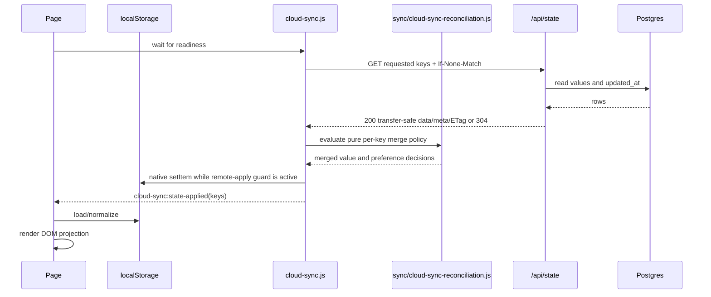
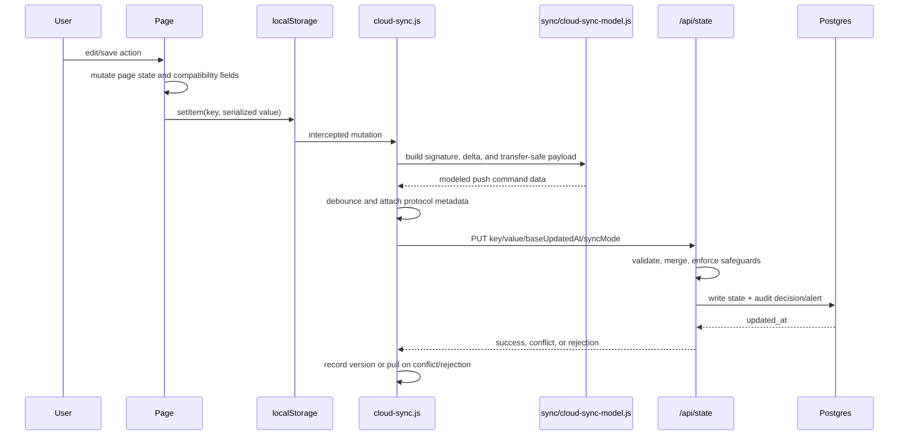

# Data Flow

## Source-of-truth rules

1. Postgres `app_state` is the authoritative shared state for seven keys.
2. Browser `localStorage` is the working copy/cache and may temporarily be newer while a debounced write is pending or the network is unavailable.
3. Page memory and DOM are projections, not authorities.
4. Vercel Blob is authoritative for objects referenced by durable public/archive URLs; legacy data URLs may still be embedded in exhibition state.
5. Snapshot tables and archives are recovery sources, not live state, until an explicit restore writes back to `app_state`.

## Generic synchronized read

## Generic synchronized write

There is no browser transaction spanning page memory, local storage, network, and Postgres. Existing undo/backups/snapshots are feature-specific compensating mechanisms.

In these diagrams, `Sync` is the effectful `cloud-sync.js` orchestrator, `Model` is `sync/cloud-sync-model.js`, and `Reconcile` is `sync/cloud-sync-reconciliation.js`. The seven-key and pathname activation contract is owned by `sync/cloud-sync-protocol.js`. The ordered classic-script boundary is part of runtime composition.

## Authentication and users

- **Shared authority:** `users` row in `app_state`.
- **Session projection:** `currentUser` in local storage.
- **Read path:** login loads synchronized users; `findUserForLogin` selects a record; successful login stores `currentUser`; page guards derive access from account/site/studio/gallery role fields.
- **Write path:** signup, profile editing, approvals, role edits, password reset, and deletion write `users`; cloud sync builds user deltas; the API matches identities, preserves passwords where required, and enforces user-drop/password/admin invariants.
- **Refresh path:** users-state application may reconcile `currentUser` with the updated user record.
- **Do not combine with refactor:** password hashing, server sessions, endpoint authorization, or role-schema normalization.

## Exhibitions and inventory

- **Authority:** `exhibitions` state contains exhibition metadata and nested inventory/sales/file/image-compatible records.
- **List path:** `exhibitions.js` reads the local projection, applies invitation/role filtering, renders rows, and writes newly created records.
- **Detail path:** `initDetailPage` waits for sync, selects the query-string exhibition, initializes compatibility structures, restores page UI state/backups, and delegates tab rendering.
- **Mutation path:** detail handlers update the active exhibition, call `saveExhibition`, persist the full local list, and trigger a delta push through storage interception.
- **Server path:** `/api/state` detects suspicious inventory drops, merges by exhibition identity/timestamp, preserves preview fields, processes image references, persists, and audits.
- **Summary path:** `inventory.js` requests `view=summary`, applies access filtering, and uses local exhibitions only as fallback.

### Representation matrix

| Concept | Representations observed | Classification |
| --- | --- | --- |
| Unsold artwork | `works`, `artWorks` and mode-dependent initialization/synchronization | Ambiguous active compatibility; not proven aliases globally |
| Goods | Goods list(s) and sold-goods records | Active domain separation |
| Sales | Sold artwork/goods arrays plus accounting projections | Intentional persisted record plus derived view |
| Inventory clear | Empty/missing lists plus explicit clear/reset markers | Safety protocol, not ordinary field normalization |
| Image | URL, preview URL, full data URL, preview data URL, legacy file/preview fields | Compatibility pending separate migration |
| Edit state | Persisted exhibition plus page-local buffers, selections, snapshots, undo stacks | Intentional UI transaction approximation |

No structural stage may rename, merge, delete, or synthesize these persisted fields unless byte-for-byte output fixtures prove that the old controller already does so.

## Exhibition images and files

1. Browser file/image input creates a preview or data URL.
2. `/api/upload` may write bytes to Vercel Blob and return a public URL.
3. Exhibition records retain URL and compatibility payload fields according to current controller rules.
4. State PUT may call image-reference logic with an upload budget; transfer-safe GET strips legacy payload only when safe URL conditions are met.
5. Client preview-preservation merge may reattach local preview fields omitted from the response.

The same visible image can therefore have Blob bytes, a URL in Postgres JSONB, a local data URL, and a rendered object/data URL. Cleanup is a data migration with observability and rollback, not a module extraction.

## Exhibition snapshots

- Capture reads the current exhibition from shared state, builds a snapshot payload, inserts metadata/payload, and optionally archives to Blob.
- Automatic snapshots use KST slot/date deduplication and retention rules.
- Restore resolves database payload or archive fallback and writes a replacement exhibition back to live `exhibitions` state.
- Undo finds the latest unconsumed restore point and applies the compensating snapshot path.
- Detail-page refresh then pulls `/api/state` and updates local storage/rendering.

Snapshot extraction must preserve transaction ordering, deduplication results, KST boundaries, archive fallback, retention, and undo-consumption semantics.

## Studio calendar

- **Authority:** `studio-calendar-state-v1` with events, base rules, timelines, week overrides, studio users, and teaching log structures.
- **Read/projection:** `pottery-master-calendar.js` normalizes state, expands occurrences for week/month dates, calculates occupancy/lanes, and renders calendar cells/bubbles.
- **Interaction:** pointer/touch/modal state records draft create/move/resize operations; preview functions validate and mutate DOM; finalizers update calendar state and save.
- **Recurring operations:** one/following/all behaviors may split or truncate series and interact with base rules/overrides.
- **Downstream readers:** students derive attendance/credits; personal work derives usage; accounting derives monthly class revenue.

Changing occurrence semantics has a larger blast radius than the calendar page. A pure occurrence/query module should be adopted by downstream readers only after shared golden fixtures show parity.

## Students

- **Authority:** `pottery-students-v1`; calendar is a second input and can also be written by student-add workflows.
- **Input:** form plus slot-picker selection creates a student and corresponding calendar event.
- **Payment model:** current fields, payment date history, payment records, cycle credits, carry-over, and manual adjustments contribute to displayed balance.
- **Attendance model:** calendar occurrences are filtered by student/date/range to compute completed classes and detail tables.
- **Output:** table/detail projections and synchronized student/calendar writes.

Parallel payment fields are compatibility and audit history. Their precedence and update rules require fixtures from representative historical records before extraction.

## Personal work

- **Authority:** `pottery-personal-work-v1` membership/payment records.
- **Inputs:** `users` supplies selectable identities; calendar events supply usage occurrences.
- **Computation:** cycle boundaries, effective payment dates, dormancy windows, and occurrence duration yield usage/payment-required projections.
- **Writes:** add/edit/delete/dormancy/payment actions persist personal-work records; calendar is currently read for usage.
- **Output:** active/dormant tables and payment/usage detail modals.

## Material orders

- **Authority:** `pottery-material-orders-v1`; product options include local-only cache behavior.
- **Edit path:** row/grid events update edit buffers, line items, group discounts/shipping, manual merge metadata, and undo snapshots before saving orders.
- **Render path:** order/item hierarchy becomes rows with computed rowspans/colspans; manual cell merges alter DOM after render.
- **Sync path:** the pure reconciliation module applies the material-order-specific identity/timestamp/item merge; the cloud-sync orchestrator owns local application and any repair push.
- **Output:** table projection and spreadsheet/CSV download.

Visual cell merging is not the same as business item grouping. Keep DOM merge extraction separate from order calculations.

## Accounting

- **Persisted authority:** `pottery-accounting-v1` contains manual/fixed/override entries.
- **Read fan-in:** exhibitions, students, personal work, material orders, and calendar feed automatic entries.
- **Projection:** `buildFinanceForTab` requests category snapshots; `buildAutoEntries` dispatches category-specific calculators; manual and automatic entries are merged for month/tab/side totals.
- **Mutation:** only manual accounting entries/overrides are persisted by this page; derived auto entries should remain reproducible projections.
- **Output:** summary/category/detail tables and XLSX/CSV files.

Tests must prove that extraction does not accidentally persist derived entries, change deduplication identities, alter month boundaries, or round values differently.

## API and database flow

| Route | Read | Write | Special behavior |
| --- | --- | --- | --- |
| `/api/state` GET | `app_state` | None | Key allowlist, metadata/ETag, summary/transfer-safe views |
| `/api/state` PUT | `app_state` | state, write audit, alerts; possible Blob image write | Version checks, per-key merge, invariants/drop guards |
| `/api/state` DELETE | `app_state` | delete plus audit | Administrative/destructive boundary |
| `/api/exhibition-snapshots` | state/snapshot tables, optional Blob archive | snapshot/live state/restore markers | Capture/list/restore/undo actions |
| `/api/snapshots-cron` | exhibitions | snapshots/archives/retention deletes | KST slots and cron authorization |
| `/api/upload` | request payload | Blob | Public URL verification |
| `/api/exhibition-image-migration` | exhibitions | Blob and exhibitions | Explicit migration; keep outside refactor |
| `/api/health`, `/api/state-audit` | DB/audit tables | None | Operational visibility |

All runtime and cron paths must use restricted DML roles. The stale lazy DDL observed on this branch is not part of the target flow.

## Data migrations explicitly separated from refactoring

The following require independent proposals, backups, dry runs, observability, and rollback:

- legacy base64/image payload removal or Blob backfill;
- `works`/`artWorks` investigation and normalization;
- student payment-history or calendar state-shape normalization;
- auth/user credential or role-schema migration;
- snapshot retention/archive policy changes;
- deletion or archival of `tmp/` operational evidence.
