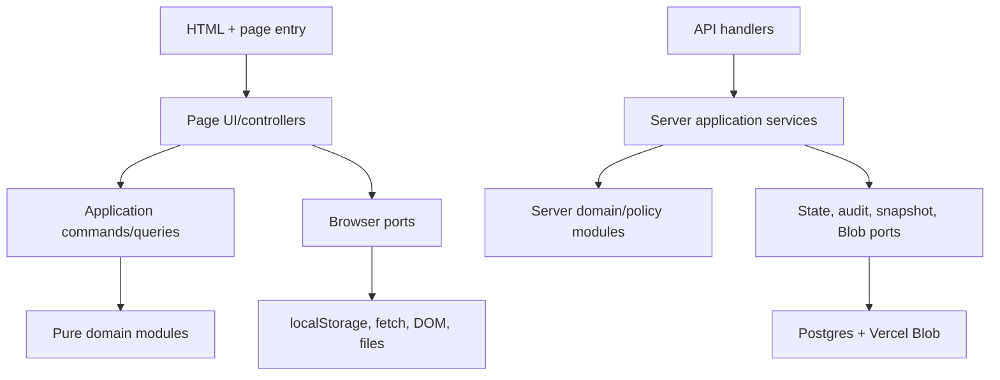

# Target Architecture

## Design goals

- Preserve the multi-page product and current user workflows.
- Make business rules callable without DOM, network, storage, clock, or global state.
- Keep page scripts as explicit composition roots rather than creating one application singleton.
- Put browser storage, HTTP, Postgres, Blob, clock, download, and DOM behind narrow adapters.
- Preserve all serialized shapes and compatibility rules during structural stages.
- Keep browser and server implementations separate where runtime/module systems differ, while sharing protocol fixtures and specifications.
- Allow each extraction to be compared with the old implementation and reverted independently.

## Dependency rule

Dependencies point inward:



Pure domain modules do not import page controllers or infrastructure. Page entry files may know every dependency needed to compose that page.

## Proposed directory tree

The names below are targets, not files to create in this audit.

```text
src/
  browser/
    core/
      auth-policy.js
      storage-adapter.js
      sync-client.js
      sync-events.js
      html-escape.js
      date-time.js
      currency.js
    exhibitions/
      exhibition-model.js
      inventory-policy.js
      sales-model.js
      accounting-model.js
      image-compatibility.js
      snapshot-client.js
      export-model.js
      detail-page.js
      list-page.js
      inventory-page.js
    studio/
      calendar-occurrences.js
      calendar-occupancy.js
      calendar-commands.js
      calendar-projection.js
      calendar-page.js
    students/
      payment-cycles.js
      attendance.js
      student-projection.js
      students-page.js
    personal-work/
      cycles.js
      usage.js
      personal-work-page.js
    material-orders/
      order-model.js
      order-projection.js
      grid-merge-model.js
      material-orders-page.js
    accounting/
      auto-entries.js
      class-occurrences.js
      finance-projection.js
      accounting-page.js
  server/
    state/
      state-handler.js
      state-service.js
      state-key-policies.js
      user-merge.js
      exhibition-merge.js
      inventory-drop-policy.js
      transfer-views.js
    snapshots/
      exhibition-snapshot-service.js
      snapshot-repository.js
      snapshot-archive.js
    images/
      image-reference-plan.js
      image-migration-service.js
    adapters/
      postgres-state-repository.js
      postgres-audit-repository.js
      blob-store.js
      http.js
tests/
  fixtures/
    state/
    exhibitions/
    calendar/
    students/
    accounting/
  unit/
  api/
  browser/
  e2e/
```

### Transitional location rule

The first implementation stages may use root-level classic scripts such as `shared/date-time.js` if introducing `src/` would require a bundler or route change. Architecture is defined by dependency direction and contract, not directory aesthetics. Move entry files only when HTML-loading tests and deployment path checks exist.

## Module contracts

### Page orchestrators

Each `*-page.js` should own:

- DOM lookup and event binding;
- conversion between DOM inputs and application command inputs;
- calls to domain queries/commands and adapters;
- rendering and focus/selection restoration;
- subscription to cloud-sync events;
- page startup, teardown, and timer lifecycle.

It should not own calendar recurrence, payment balance, accounting aggregation, merge policy, or serialized compatibility transformations.

### Domain modules

Domain functions accept explicit data and options and return values or command plans. They do not read globals or mutate caller data unless mutation is an explicit, tested contract.

Examples:

```javascript
buildStudentStats({ student, calendar, asOfDate })
collectClassOccurrences({ events, month, timezone })
planCalendarEdit({ calendar, occurrence, edit, mode })
buildAccountingProjection({ month, tab, datasets, categories })
detectInventoryDrop({ current, incoming, touchedIds, thresholds })
```

### Browser ports

```javascript
storage.read(key)
storage.write(key, serializedValue)
storage.remove(key)
stateClient.get(keys, options)
stateClient.put(command)
clock.now()
downloads.save(blob, filename)
```

The transitional storage adapter must delegate to existing native/patched behavior so writes still trigger cloud sync. It must not create a second synchronization mechanism.

### Server services and repositories

The state handler should parse HTTP and map service results to responses. A state service should orchestrate version checks, key policy, persistence, audit, and alerts. Per-key policies should be pure where possible. Repositories own SQL only; Blob adapters own object operations only.

No server module except an explicit migration command may execute DDL. Runtime repositories must fail visibly if schema is absent.

## State ownership

| State | Owner | Other consumers |
| --- | --- | --- |
| Synchronized transport metadata | Sync client | Storage adapter/page startup through read-only status |
| User and role records | User domain/state key policy | Auth and page access projections |
| Exhibition aggregate | Exhibition domain/repository boundary | Detail/list/inventory/accounting |
| Calendar aggregate | Studio calendar domain | Students, personal work, accounting queries |
| Student aggregate | Student domain | Calendar labels and accounting |
| Personal-work aggregate | Personal-work domain | Calendar and accounting |
| Material-order aggregate | Material-order domain | Accounting |
| Manual accounting entries | Accounting domain | Accounting page/export |
| Derived accounting entries | Pure accounting projection | Render/export only; never persisted as source records |

## Compatibility strategy

1. Parse current values without deleting unknown fields.
2. Preserve current output shape and field precedence.
3. Put compatibility access behind named selectors/serializers, not ad hoc renderer checks.
4. Keep old and new implementation callable in tests during each extraction.
5. Compare outputs on sanitized production-like fixtures.
6. Remove old code only after parity and a full page smoke pass.
7. Plan data normalization separately with backup, dry run, metrics, and rollback.

## Browser module transition

The current HTML pages use ordered classic scripts. An incremental transition can use one frozen namespace per domain, for example `window.GalleryDomain`, before adopting ES modules. This is not the final ideal, but it avoids simultaneous bundler, caching, path, and behavior changes.

Rules for transitional globals:

- one namespace assignment per module;
- frozen exported API where practical;
- no initialization on module evaluation;
- no direct DOM or storage access in domain namespaces;
- explicit script order recorded in HTML and dependency tests;
- page globals used by inline/generated handlers retained until those handlers are replaced and tested.

## CSS architecture

Target layers:

1. tokens/base typography and element defaults;
2. shared layout/navigation/forms/tables/modals;
3. page/domain components;
4. responsive rules colocated with the owning component or in a documented responsive layer;
5. print/export-specific output styles.

Do not start by concatenating or deduplicating selectors. First inventory actual selector usage and capture desktop/mobile screenshots. `mobile-draft.css` is an active override layer despite its name.

## Observability and failure contracts

- State commands return explicit success/conflict/rejected/unavailable results.
- Page orchestrators decide user feedback and focus recovery.
- Sync exposes status without requiring consumers to inspect internal maps.
- Server policy decisions retain request ID, key, decision, reason, counts, and client ID in audit records.
- Snapshot and image services report partial Blob outcomes explicitly while preserving current behavior until a separate improvement is approved.
- Timers and subscriptions return teardown functions to make tests and navigation deterministic.

## Non-goals

- A framework rewrite or single-page application.
- A database-per-domain redesign.
- New API shapes or authentication mechanisms.
- New state schemas, renamed keys, or compatibility cleanup.
- Visual redesign.
- Performance caching before correct invalidation rules are demonstrated.
- Moving/deleting operational artifacts.
